# Build Real-Time Streaming Demo Web App (React) with Amazon IVS

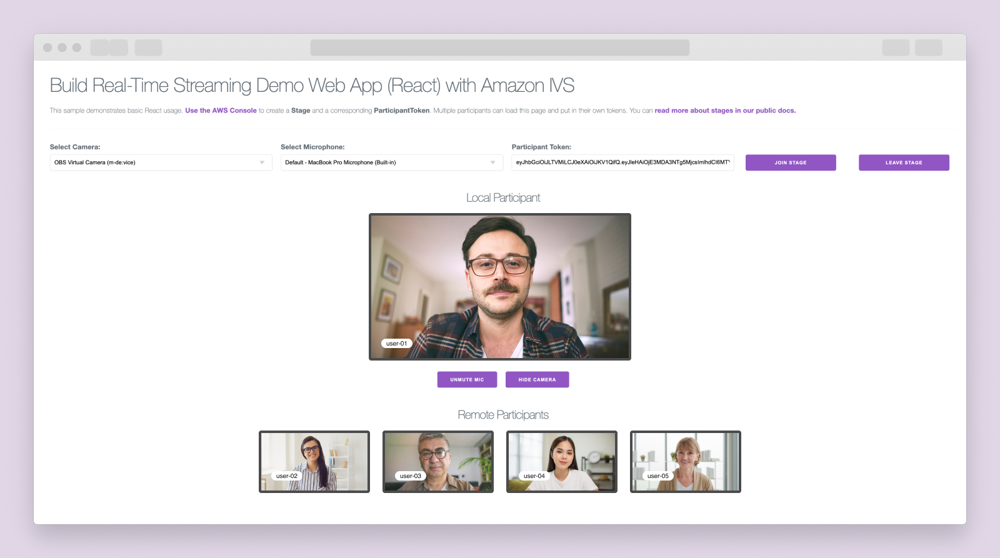

## Project Description
 Follow this guide to create a React demo web application with sub-300ms latency using [Amazon IVS Web Broadcasting SDK](https://docs.aws.amazon.com/ivs/latest/RealTimeUserGuide/broadcast.html). You will get hands-on experience with real-time streaming core concepts and the SDK to broadcast your camera and microphone and view multiple participant streams in real-time. 


You will use:

- Next.js is an open-source [React](https://react.dev/) framework that facilitates the development of efficient, production-ready web applications with features such as automatic code splitting, client-side routing, CSS support, and server-side rendering.
  - [Next.js Documentation](https://nextjs.org/docs) - learn about Next.js features and API.
  - [Learn Next.js](https://nextjs.org/learn) - an interactive Next.js tutorial.
  - You can check out [the Next.js GitHub repository](https://github.com/vercel/next.js/)
- Milligram CSS for basic CSS styling (https://milligram.io/)
- [ESLint](https://eslint.org/) which is a code quality and consistency tool that helps developers catch mistakes and bugs early during the development process.
- [`next/font`](https://nextjs.org/docs/basic-features/font-optimization) to automatically optimize and load Inter, a custom Google Font.

This repository contains two directories: /hello-world/client and /hello-world-with-grid-layout/client. These directories contain sample code in reactJs for a real-time interactive web application using Amazon IVS broadcast SDK and /hello-world-with-grid-layout/client has an additional feature to support dynamic grid layout when multiple participants join a stage. You can choose to run the finished code or follow instructions to create a web app from scratch - 

## You will learn how to:

- [Run the finished code](#run-the-finished-code)
- [Create app from scratch](#create-app-from-scratch)
  - [1. Prerequisites](#1-prerequisites)
  - [2. Configure server and file structure](#2-configure-server-and-file-structure)
  - [3. Launch the application server](#3-launch-the-application-server)
  - [4. Create a stage from the AWS console](#4-create-a-stage-from-the-aws-console)
  - [5. Initialize and integrate with the web broadcast SDK](#5-initialize-and-integrate-with-the-web-broadcast-sdk)
  - [6. Configure device permissions for media control](#6-configure-device-permissions-for-media-control)
  - [7. Set up and initialize the stage](#7-set-up-and-initialize-the-stage)
  - [8. Handle joining the stage and controlling the stream](#8-handle-joining-the-stage-and-controlling-the-stream)
  - [9. Manage the departure of participants from the stage](#9-manage-the-departure-of-participants-from-the-stage)
  - [10. Generate tokens for participants and facilitate them joining a stage](#10-generate-tokens-for-participants-and-facilitate-them-joining-a-stage)
  - [11. Add multiple participants to a stage](#11-add-multiple-participants-to-a-stage)
- [Advanced features](#advanced-features)
  - [Create a dynamic grid layout for multiple participants on a stage](#create-a-dynamic-grid-layout-for-multiple-participants-on-a-stage)
- [Next steps](#next-steps)

## Run the finished code

### 1. Prerequisites

- a. To check for `Node.js` and `npm` installation, open your terminal and execute `node -v` and `npm -v` commands.

\*Note: If not installed, refer to the official Node.js and npm installation guide at https://docs.npmjs.com/downloading-and-installing-node-js-and-npm.

### 2. Create a stage

- a. Clone this repository and navigate to the client folder of the `hello-world` (hello-world/client) or `hello-world-with-grid` repository.
- b. Inside your terminal, run the following commands then navigate to `http://localhost:3000`:

  ```
  npm install
  npm run dev
  ```
- c. In your Amazon console, navigate to Amazon IVS > Real-time streaming > Stages, then at the top right hand corner click ["Create stage"](https://docs.aws.amazon.com/ivs/latest/RealTimeUserGuide/getting-started-create-stage.html)

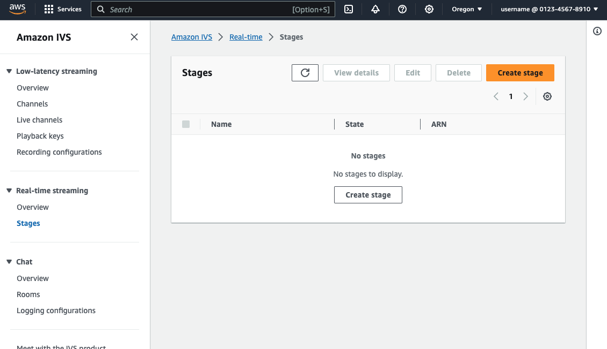

- d. Under "Setup" enter a stage name (this is optional) and any tags associated with the resource. Then, Click on "Create stage" at the bottom right hand corner of the page.

\*Note: A [tag](https://docs.aws.amazon.com/tag-editor/latest/userguide/tagging.html) is a label that you assign to an AWS resource. Each tag consists of a key and an optional value. You can use tags to search and filter your resources or track your AWS costs.

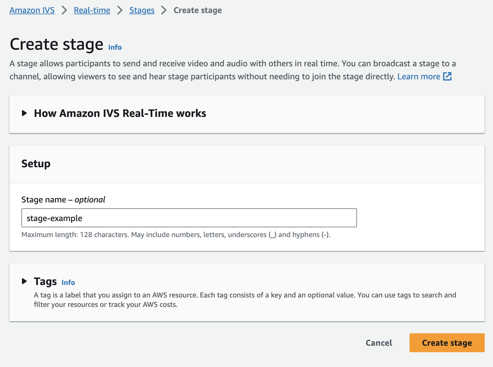

### 3. Create participant tokens

- a. Now, navigate back to stages inside of your AWS console (Amazon IVS > Real-time streaming > stages) and click on your newly created stage from step 2.

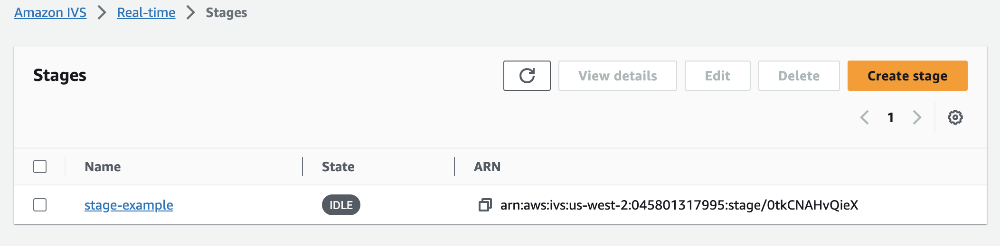

- b. To initiate and join the stage, you must generate a [participant token](https://docs.aws.amazon.com/ivs/latest/RealTimeAPIReference/API_ParticipantToken.html) for access. Click into your newly created stage and find the header "Participant tokens". Beside this header click the "Create a participant token" button:

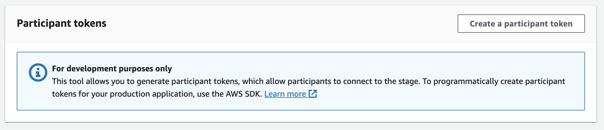

- c. Create a participant token by completing the required information.

  - Under UserId: Enter any UTF-8 encoded text up to 128 characters long.
  - Under Capabilities: Choose both publish and subscribe/
  - Under Token duration: if you want to specify a duration, you can do it here, otherwise the duration defaults to 720 min.
  - Under Attributes: To include supplementary data in your token, click 'add attribute' to provide a key-value pair. In this example, you should add the attribute with Key: `'username'` and Value: `'stageUser'`, which will display the username `'stageUser'` over the video if available.
    > ie. Key: username | Value: stageUser

  \*Note: In the absence of a provided `username` in the `token`, the overlay will display the participant's number within the stage as `'user-{participantSize}'`.

  - Click "Create a participant token" at the bottom right hand corner of the modal.

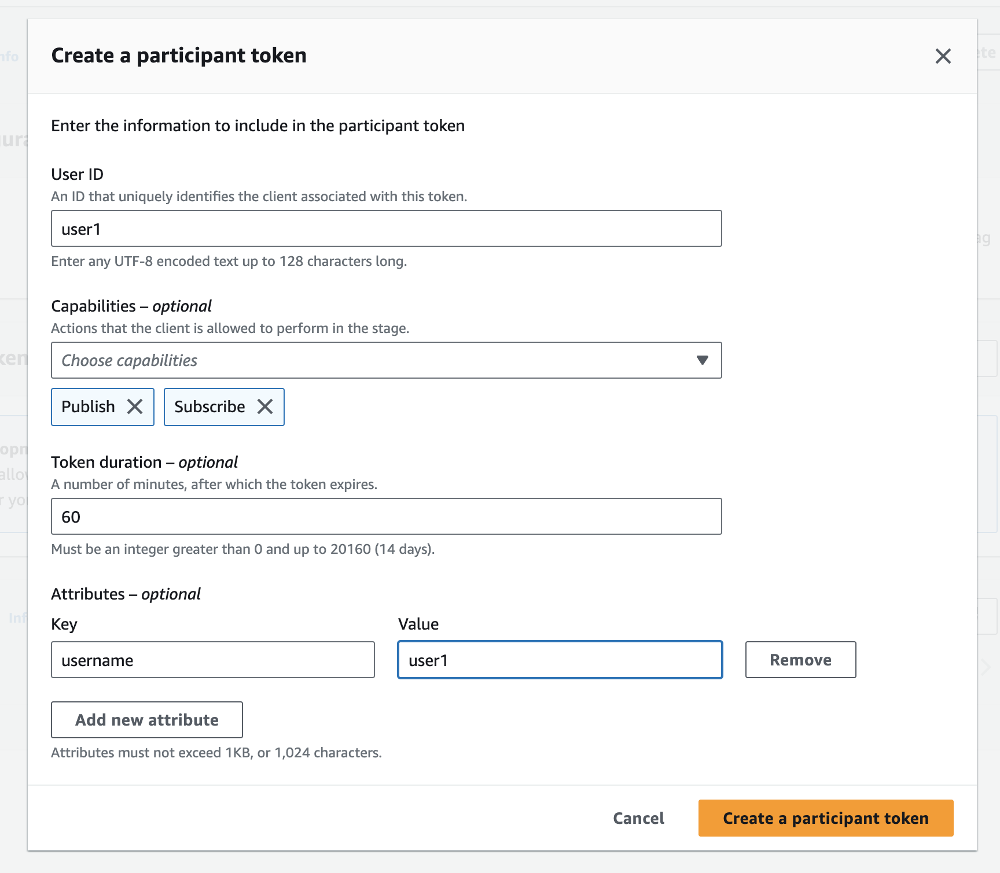

- d. Once the token is created, copy and paste it into your application (you now have access to a token that you will need to join a stage):


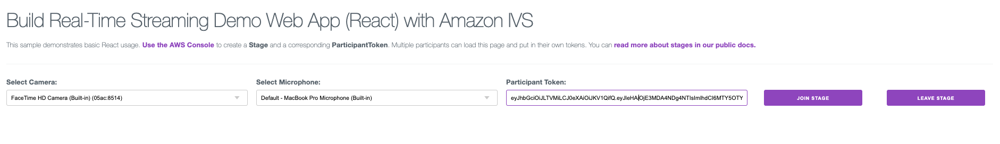

- e. Select your camera and microphone, then click `Join Stage`.

**Congratulations! You have successfully run a demo web application that enables real-time streaming among multiple participants using the Amazon IVS Web Broadcasting SDK.**

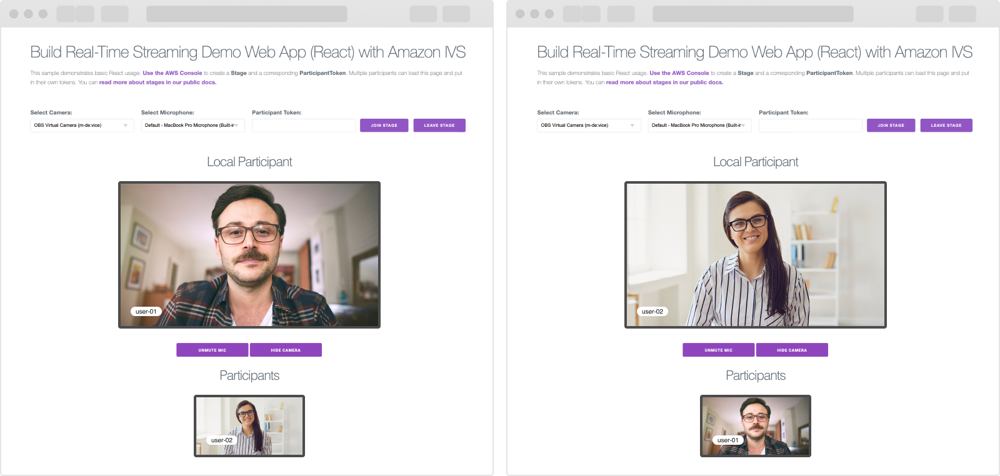

## Create app from scratch

### 1. Prerequisites

- a. To check for `Node.js` and `npm` installation, open your terminal and execute `node -v` and `npm -v` commands.

\*Note: If not installed, refer to the official Node.js and npm installation guide at https://docs.npmjs.com/downloading-and-installing-node-js-and-npm.

### 2. Configure server and file structure

- a. Open up your terminal and create a `hello-world` directory (`mkdir hello-world`), then navigate into that directory (`cd hello-world`).

- b. Run the following command inside the `hello-world` directory to create a new `Next.js` application, which will serve as your starting point.

  ```
    npx create-next-app@latest
  ```

- c. During installation, you'll face specific prompts. Choose your preferred setup tool for the project, and for this particular project, the answers are as follows:

  ```
    // Set the project name to "client"
    What is your project named? client

    // Decide whether to use TypeScript; choose "No" to opt out
    Would you like to use TypeScript? No

    // Choose whether to use ESLint for code quality and consistency; choose "Yes" to enable
    Would you like to use ESLint? Yes

    // Decide whether to use Tailwind CSS for utility-first CSS; choose "No" to skip
    Would you like to use Tailwind CSS? No

    // Use the 'src/' directory to organize the project structure; choose "Yes" to implement
    Would you like to use `src/` directory? Yes

    // Enable the App Router for managing client-side page transitions; select "Yes" for recommended usage
    Would you like to use App Router? (recommended) Yes

    // Customize the default import alias for the project; choose "Yes" to modify the default import alias
    Would you like to customize the default import alias (@/*)? Yes

    // Specify the import alias configuration; enter the desired import alias or choose "No" to skip
    What import alias would you like configured? No
  ```

Following these prompts, `create-next-app` will establish a folder with your project name and install the necessary dependencies.

- d. Please ensure that your `package.json` file has a setup similar to this:

  **`client/package.json`**

  ```client/package.json
    {
      "name": "client",
      "version": "0.1.0",
      "private": true,
      "scripts": {
        "dev": "next dev",
        "build": "next build",
        "start": "next start",
        "lint": "next lint"
      },
      "dependencies": {
        "react": "^18",
        "react-dom": "^18",
        "next": "14.0.1"
      },
      "devDependencies": {
        "eslint": "^8",
        "eslint-config-next": "14.0.1"
      }
    }
  ```

- e. Remove unnecessary boilerplate code from your application by opening `src/app/page.js` and replacing the file with the provided code snippet.

  **`client/src/app/page.js`**

  ```client/src/app/page.js
    export default function Home() {
      return (
      <div>Hello world</div>
      )
    }
  ```

- f. Use your terminal or editor (e.g., VSCode) to create this file structure:

  ```
  hello-world
  │
  └───client
  │   │   .eslintrc.json
  │   │   package.json
  │   │   jsconfig.json
  │   │   next.config.js
  │   │
  │   │
  │   └───src
  │       └───app
  │           └───components
  │           └───utils
  │           layout.js
              page.js
              globals.css
  ```

### 3. Launch the application server

- a. Navigate to the newly created `client` directory and execute the command `npm run dev`. Then, in your browser, visit `http://localhost:3000` to view the freshly generated [`NextJS`](https://nextjs.org/docs) application.

> [!IMPORTANT]
> Your application should resemble this:

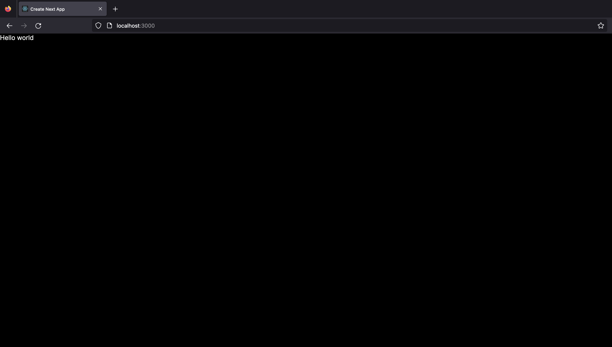

### 4. Create a stage from the AWS console

- a. In your Amazon console, navigate to Amazon IVS > Real-time streaming > Stages, then at the top right hand corner click ["Create stage"](https://docs.aws.amazon.com/ivs/latest/RealTimeUserGuide/getting-started-create-stage.html)


- b. Under "Setup" enter a stage name (this is optional) and any tags associated with the resource. Then, Click on "Create stage" at the bottom right hand corner of the page.

\*Note: A [tag](https://docs.aws.amazon.com/tag-editor/latest/userguide/tagging.html) is a label that you assign to an AWS resource. Each tag consists of a key and an optional value. You can use tags to search and filter your resources or track your AWS costs.


### 5. Initialize and integrate with the web broadcast SDK

The Web broadcast SDK is distributed as a JavaScript library and can be retrieved through https://web-broadcast.live-video.net/1.6.0/amazon-ivs-web-broadcast.js. This is where you are integrating with IVS broadcast SDK for real-time streaming.

- a. Navigate to the `src/app/page.js` file. Make sure to include the [`IVSBroadcastClient`](https://docs.aws.amazon.com/ivs/latest/RealTimeUserGuide/broadcast.html) (https://web-broadcast.live-video.net/1.6.0/amazon-ivs-web-broadcast.js) SDK script within the `<Script>` tag.

  **`src/app/page.js`**

  ```src/app/page.js

    import Script from "next/script";
    export default function Home() {

      return (
        <div>
          <Script src="https://web-broadcast.live-video.net/1.6.0/amazon-ivs-web-broadcast.js"></Script> // Include the Amazon IVS Web Broadcast JavaScript library
          Hello world
        </div>
      );
  }
  ```

- b. Add the following line to your `layout.js` file's `<head>` section; `layout.js` serves as the root layout component for the web page structure.

  **`src/app/layout.js`**

  ```src/app/layout.js
    <link
      rel="stylesheet"
      href="https://cdnjs.cloudflare.com/ajax/libs/milligram/1.4.1/milligram.css" // Link to the Milligram CSS stylesheet
    />
  ```

  - By importing the [Milligram CSS framework](https://milligram.io/) from the CDN, you can leverage its minimalist styling for your web project. Milligram offers a range of predefined classes such as `container`, `h1`, `p`, and `button` that you can directly use in your HTML elements to apply its clean and minimalistic design to your web content.

> [!IMPORTANT]
> This is the current structure of your `layout.js` file:

**`src/app/layout.js`**

```src/app/layout.js
    import "./globals.css"; // Import the global CSS file

    export const metadata = {
      title: "Real Time Streaming", // Specify the title for the web page
      description: "Real-time streaming on AWS enables the seamless and instantaneous delivery of audio, video, or data content to end-users, leveraging AWS services and infrastructure."
    };

    export default function RootLayout({ children }) {
      return (
        <html lang="en">
          <head>
            <link
              rel="stylesheet"
              href="https://cdnjs.cloudflare.com/ajax/libs/milligram/1.4.1/milligram.css" // Link to the Milligram CSS stylesheet
            />
          </head>
          <body>{children}</body>
        </html>
      );
    }
```

- c. Update the `global.css` file with these CSS styles.

  **`src/app/global.css`**

  ```src/app/global.css

    :root {
      --foreground-rgb: 0, 0, 0;
      --background-start-rgb: 214, 219, 220;
      --background-end-rgb: 255, 255, 255;
    }

    @media (prefers-color-scheme: dark) {
      :root {
        --foreground-rgb: 255, 255, 255;
        --background-start-rgb: 0, 0, 0;
        --background-end-rgb: 0, 0, 0;
      }
    }

    html,
    body {
      margin: 2rem;
      box-sizing: border-box;
      height: 100vh;
      max-height: 100vh;
      display: flex;
      flex-direction: column;
      color: rgb(var(--foreground-rgb));
      background: white
    }

    hr {
      margin: 1rem 0;
    }

    table {
      display: table;
    }

    canvas {
      margin-bottom: 1rem;
      background: grey;
    }

    video {
      margin-bottom: 1rem;
      background: black;
      max-width: 100%;
      max-height: 150px;
      aspect-ratio: 16 / 9;
      border: 0.5rem solid #555;
      border-radius: 0.5rem;
      width: 100%;
    }

    h3 {
      display: flex;
      justify-content: center;
      padding-top: 3rem
    }

    .center {
      display: flex;
      justify-content: center;
    }

    .log {
      flex: none;
      height: 300px;
    }

    .content {
      flex: 1 0 auto;
    }

    .margin-top {
      margin-top: 5rem
    }

    .button-container {
      display: flex !important;
      margin-top: 2.5rem;
      align-items: center;
      justify-content: space-around;
    }

    .button-container .button {
        width: 45%
    }

    .local-container {
      position: relative;
    }

    .static-controls {
      position: relative;
      margin-left: auto;
      margin-right: auto;
      left: 0;
      right: 0;
      bottom: 0;
      text-align: center;
    }

    .static-controls button {
      display: inline-block;
      margin: 1rem;
    }

    .hidden {
      display: none;
    }

    .participant-container {
      display: flex;
      align-items: center;
      justify-content: center;
      flex-direction: column;
      margin: 1rem;
    }

    .relative {
      position: relative;
    }

    .overlay-pill {
      position: absolute;
      bottom: 40px;
      left: 24px;
      padding: 0px 12px;
      background-color: #fff;
      color: black;
      border-radius: 20px;
      font-size: 14px;
    }

    .placeholder {
      background-color: #333333;
      display: flex;
      text-align: center;
      margin-bottom: 1rem;
    }

    .placeholder span {
      margin: auto;
      color: white;
    }

    .device-container {
      display: flex;
      width: 100%;
      justify-content: space-between;
    }
    .local-video {
      max-height: 300px;
      display: inline-block;
      width: 100vw;
      max-width: 500px
    }

    .video-container {
      width: 100%;
      display: flex;
      justify-content: space-evenly;
    }

    .margin {
      margin: 3rem;
    }

    .remote-participant-video {
      display: flex;
      justify-content: center;
      align-items: center;
      flex-direction: row;
      width: 100%;
      height: auto;
      max-width: 300px;
      aspect-ratio: 16 / 9;
    }

    .margin-right {
      margin-right: 1rem;
    }
  ```

- d. In the `page.js` file, establish an asynchronous function named `initialize` and a [state](https://react.dev/reference/react/useState) named `isInitializeComplete`, setting it to `true` within the function. This signifies that the [`web broadcast client`](https://docs.aws.amazon.com//ivs/latest/RealTimeUserGuide/broadcast.html) is loaded when this component mounts. Then call the `initialize` function after the script has loaded using the `onLoad` callback.

\*Note: Add the line [`"use client"`](https://nextjs.org/docs/app/building-your-application/rendering/client-components) at the top of the file to enable the use of React hooks within your `Next.js` application.

**`src/app/page.js`**

```src/app/page.js
  "use client";
  import { useState } from "react";

  export default function Home() {

    const [isInitializeComplete, setIsInitializeComplete] = useState(false);

    /**
    * Initialize after the client is loaded
    */
    const initialize = async () => {
      // Set the value of isInitializeComplete to true
      setIsInitializeComplete(true);
    };

    return  <div>
    <Script src="https://web-broadcast.live-video.net/1.6.0/amazon-ivs-web-broadcast.js"
    onLoad={initialize} // Call the 'initialize' function after the script has loaded
    >
    </Script>
    Hello world
  </div>
  }
```

- e. Inside the `components` folder create the following components and call them `Header.js`, `Input.js`, `Select.js`. Navigate into each file and add the following code:

  - `Header.js` will create a simple header component to introduce your application.

  **`src/app/components/Header.js`**

  ```src/app/components/Header.js
    const Header = () => {

      return (
        <header>
          <h1>Build Real-Time Streaming Demo Web App (React) with Amazon IVS</h1>
          <p>
            This sample demonstrates basic React usage.{" "}
            <b>
              <a href="https://docs.aws.amazon.com/ivs/latest/userguide/multiple-hosts.html">
                Use the AWS Console{" "}
              </a>
            </b>
            to create a <b>Stage</b> and a corresponding <b>ParticipantToken</b>.
            Multiple participants can load this page and put in their own tokens.
            You can{" "}
            <b>
              <a
                href="https://aws.github.io/amazon-ivs-web-broadcast/docs/sdk-guides/stages#glossary"
                target="_blank"
              >
                read more about stages in our public docs.
              </a>
            </b>
          </p>
        </header>
      );
    };

    export default Header;
  ```

  - `Input.js` is used to create a labeled input field that allows users to update the value based on their input.

  **`src/app/components/Input.js`**

  ```src/app/components/Input.js
    const Input = ({ label, value, onChange }) => {
      return (
        <div className="column">
          <label>{`${label}:`}</label>
          <input
            value={value}
            onChange={(e) => onChange(e.target.value)}
            type="text"
          ></input>
        </div>
      );
    };

    export default Input;
  ```

  - The `Select` component will render a dropdown list of available devices for a specific `deviceType`, allowing users to choose a device that will be updated based on the selection.

  **`src/app/components/Select.js`**

  ```src/app/components/Select.js
    const Select = ({ deviceType, devices, updateDevice }) => {
      return (
        <div className="column">
          <label>{`Select ${deviceType}:`}</label>
          <select onChange={(e) => updateDevice(e.target.value)}>
            device
            {devices?.map((device) => {
              return (
                <option
                  key={`${deviceType.charAt(0).toLowerCase() +
                    deviceType.slice(1)}-${device.deviceId}`}
                  value={device.deviceId}
                >
                  {device.label} // Displaying the label of the device
                </option>
              );
            })}
          </select>
        </div>
      );
    };

    export default Select;
  ```

  - Then, import the header into your `page.js` file.

  **`src/app/page.js`**

  ```src/app/page.js

    ...

    import Header from "./components/Header";

    export default function Home() {

      ...

      return (
        <div>
          <Script
            src="https://web-broadcast.live-video.net/1.6.0/amazon-ivs-web-broadcast.js"
            onLoad={initialize}
          ></Script>
          <Header />
          Hello world
        </div>
      );
    }
  ```

- f. In the `page.js` file, initialize the states for your devices, although they won't function at the moment; you'll be updating them in the next step.

  **`src/app/page.js`**

  ```src/app/page.js
    export default function Home() {

      ...

      const [videoDevices, setVideoDevices] = useState([]); // Stores the available video devices
      const [audioDevices, setAudioDevices] = useState([]); // Stores the available audio devices
      const [selectedVideoDeviceId, setSelectedVideoDeviceId] = useState(null); // Tracks the selected video device
      const [selectedAudioDeviceId, setSelectedAudioDeviceId] = useState(null); // Tracks the selected audio device

      ...
  ```

- g. In the `page.js` file, incorporate the `Select` component to manage audio and video devices. Utilize the `deviceType` prop to distinguish between the two and ensure the appropriate states and `onChange` functions are passed in for each.

  - Let's organize the code by enclosing this section in a `"row"` class from the [Milligram CSS framework](https://milligram.io/grids.html).

> [!IMPORTANT]
> Your `page.js` file should now look like this:

**`src/app/page.js`**

```src/app/page.js
"use client";
import { useState } from "react";
import Script from "next/script";

import Header from "./components/Header";
import Select from "./components/Select";

export default function Home() {
  const [isInitializeComplete, setIsInitializeComplete] = useState(false);

  const [videoDevices, setVideoDevices] = useState([]);
  const [audioDevices, setAudioDevices] = useState([]);
  const [selectedVideoDeviceId, setSelectedVideoDeviceId] = useState(null);
  const [selectedAudioDeviceId, setSelectedAudioDeviceId] = useState(null);

  const initialize = async () => {
    setIsInitializeComplete(true);
  };

  return (
    <div>
      <Script
        src="https://web-broadcast.live-video.net/1.6.0/amazon-ivs-web-broadcast.js"
        onLoad={initialize}
      ></Script>
      <Header />
      <div className="row">
        <Select
          deviceType="Video"
          updateDevice={setSelectedVideoDeviceId}
          devices={videoDevices}
        />
        <Select
          deviceType="Audio"
          updateDevice={setSelectedAudioDeviceId}
          devices={audioDevices}
        />
      </div>
    </div>
  );
}
```

- h. In the `page.js` file, initialize the state for the [`participantToken`](https://docs.aws.amazon.com/ivs/latest/RealTimeAPIReference/API_ParticipantToken.html), which is necessary for participants to join a stage.

  **`src/app/page.js`**

  ```src/app/page.js
    export default function Home() {

      ...

      const [participantToken, setParticipantToken] = useState("");

      ...
  ```

- i. In the `page.js` file, utilize the `Input` component to establish an input field labeled `"Participant Token"` connecting it to the `participantToken` state for value management, and to update the `participantToken` state when the input value changes. Place this component directly under the `Select` components.

  **`src/app/page.js`**

  ```src/app/page.js

  export default function Home() {

    ...

    const [participantToken, setParticipantToken] = useState("");

    ...

    return (
      <div>

        ...
        <Header />
        <div className="row">
          <Select
            deviceType="Video"
            updateDevice={setSelectedVideoDeviceId}
            devices={videoDevices}
          />
          <Select
            deviceType="Audio"
            updateDevice={setSelectedAudioDeviceId}
            devices={audioDevices}
          />
          <Input
            label="Participant Token"
            value={participantToken}
            onChange={setParticipantToken}
          />
        </div>

        ...

  }
  ```

**You've successfully established the foundation of your application.**

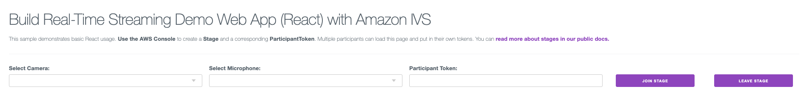

> [!IMPORTANT]
> Your file structure should now look like this:

```
hello-world
│
└───client
│   │   .eslintrc.json
│   │   package.json
│   │   jsconfig.json
│   │   next.config.js
│   │
│   │
│   └───src
│       └───app
│           └───components
│                 Header.js
│                 Input.js
│                 Select.js
│           └───utils
│           layout.js
            page.js
            globals.css
```

### 6. Configure device permissions for media control

- a. Navigate to the `utils` folder and create a new file named `mediaDevices.js`, where you will define all the essential functions required for handling media devices.

- b. Inside `mediaDevices.js`, create the constants `CAMERA = "camera"` and `MIC = "mic"`, then define an async function called `getDevices` that retrieves all the available devices and returns them.

  **`src/app/utils/mediaDevices.js`**

  ```src/app/utils/mediaDevices.js

    export const CAMERA = "camera";
    export const MIC = "mic";

    const getDevices = async () => {
      // Prevents issues on Safari/FF so devices are not blank
      await navigator.mediaDevices.getUserMedia({ video: true, audio: true });

      const devices = await navigator.mediaDevices.enumerateDevices();

      // Get all video devices
      const videoDevices = devices.filter((d) => d.kind === "videoinput");
      if (!videoDevices.length) {
        console.error("No video devices found.");
      }

      // Get all audio devices
      const audioDevices = devices.filter((d) => d.kind === "audioinput");
      if (!audioDevices.length) {
        console.error("No audio devices found.");
      }

      return { videoDevices, audioDevices };
    };
  ```

- c. In the `page.js` file, create an asynchronous function named `handleDeviceUpdate` to fetch and store video and audio devices connected to the laptop. Import the `getDevices` function from mediaDevices.js for this purpose.

  **`src/app/page.js`**

  ```src/app/page.js
    ...

    import { getDevices } from "./utils/mediaDevices";

    const handleDeviceUpdate = async () => {
      try {
        const { videoDevices, audioDevices } = await getDevices();
        setVideoDevices(videoDevices);
        setSelectedVideoDeviceId(videoDevices[0]?.deviceId);

        setAudioDevices(audioDevices);
        setSelectedAudioDeviceId(audioDevices[0]?.deviceId);
      } catch (error) {
        // Handle any errors that may occur during the device update process
        console.error("An error occurred during device update:", error);
        // You can add additional error-handling logic here as needed
      }
    };

    ...

  ```

- d. Inside the `mediaDevices.js` file, develop the `getMediaForDevices` function under your `getDevices` function, which take in a `deviceId` and `deviceType` and return the corresponding `audio` or `video` associated with that device.

  **`src/app/utils/mediaDevices.js`**

  ```src/app/utils/mediaDevices.js

    ...

    /**
    * Fetches the media stream for a specified device ID and type.
    * @param {string} deviceId - The device ID.
    * @param {string} mediaType - The media type (CAMERA or MIC).
    * @returns {Promise<MediaStream>} - The resulting media stream.
    */
    export const getMediaForDevices = async (deviceId, mediaType) => {
      const mediaConstraints = {
        video: {
          deviceId: mediaType === CAMERA && deviceId ? { exact: deviceId } : null,
        },
        audio: {
          deviceId: mediaType === MIC && deviceId ? { exact: deviceId } : null,
        },
      };

      return navigator.mediaDevices.getUserMedia(mediaConstraints);
    };
  ```

- e. Next, create a function that handles the toggling of media and specifically manages the visibility or muting of the camera or microphone.

  **`src/app/utils/mediaDevices.js`**

  ```src/app/utils/mediaDevices.js

    ...

    // Function toggles the mute status of the specified device type (CAMERA or MIC) for the local participant in a given stage.
    // Uses stageRef to access the current participant's stream and updates the state (setIsDeviceStopped) accordingly.

    export const handleMediaToggle = (deviceType, stageRef, setIsDeviceStopped) => {
      // Check if the type is 'camera'; if so, toggle the video stream
      if (deviceType === CAMERA) {
        // Access the video stream of the local participant from the stage
        const { videoStream } = stageRef.current.localParticipant;

        // Get the current status of the video stream
        const isHidden = videoStream.isMuted;

        // Toggle the mute status of the video stream
        videoStream.setMuted(!isHidden);

        // Update the state to reflect the change in visibility
        setIsDeviceStopped(!isHidden);
      }
      // If the type is 'mic', toggle the audio stream
      else if (deviceType === MIC) {
        // Access the audio stream of the local participant from the stage
        const { audioStream } = stageRef.current.localParticipant;

        // Get the current status of the audio stream
        const isMuted = audioStream.isMuted;

        // Toggle the mute status of the audio stream
        audioStream.setMuted(!isMuted);

        // Update the state to reflect the change in muting
        setIsDeviceStopped(!isMuted);
      }
    };
  ```

> [!IMPORTANT]
> Your `mediaDevices.js` file should now look like this:

**`src/app/utils/mediaDevices.js`**

```src/app/utils/mediaDevices.js
  export const CAMERA = "camera";
  export const MIC = "mic";

  /**
  * Returns all devices available on the current device
  */
  export const getDevices = async () => {
    // Prevents issues on Safari/FF so devices are not blank
    await navigator.mediaDevices.getUserMedia({ video: true, audio: true });
    const devices = await navigator.mediaDevices.enumerateDevices();

    // Get all video devices
    const videoDevices = devices.filter((d) => d.kind === "videoinput");
    if (!videoDevices.length) {
      console.error("No video devices found.");
    }

    // Get all audio devices
    const audioDevices = devices.filter((d) => d.kind === "audioinput");
    if (!audioDevices.length) {
      console.error("No audio devices found.");
    }

    return { videoDevices, audioDevices };
  };

  /**
  * Gets the media stream for the specified device ID and type.
  * @param {string} deviceId - The device ID.
  * @param {string} mediaType - The type of media ('video' or 'audio').
  * @returns {Promise<MediaStream>} - The resulting media stream.
  */
  export const getMediaForDevices = async (deviceId, mediaType) => {
    const mediaConstraints = {
      video: {
        deviceId: mediaType === CAMERA && deviceId ? { exact: deviceId } : null,
      },
      audio: {
        deviceId: mediaType === MIC && deviceId ? { exact: deviceId } : null,
      },
    };

    return navigator.mediaDevices.getUserMedia(mediaConstraints);
  };

  // Function toggles the mute status of the specified device type (CAMERA or MIC) for the local participant in a given stage.
  // Uses stageRef to access the current participant's stream and updates the state (setIsDeviceStopped) accordingly.
  export const handleMediaToggle = (deviceType, stageRef, setIsDeviceStopped) => {
    // Check if the type is 'camera'; if so, toggle the video stream
    if (deviceType === CAMERA) {
      // Access the video stream of the local participant from the stage
      const { videoStream } = stageRef.current.localParticipant;

      // Get the current status of the video stream
      const isHidden = videoStream.isMuted;

      // Toggle the mute status of the video stream
      videoStream.setMuted(!isHidden);

      // Update the state to reflect the change in visibility
      setIsDeviceStopped(!isHidden);
    }
    // If the type is 'mic', toggle the audio stream
    else if (deviceType === MIC) {
      // Access the audio stream of the local participant from the stage
      const { audioStream } = stageRef.current.localParticipant;

      // Get the current status of the audio stream
      const isMuted = audioStream.isMuted;

      // Toggle the mute status of the audio stream
      audioStream.setMuted(!isMuted);

      // Update the state to reflect the change in muting
      setIsDeviceStopped(!isMuted);
    }
  };
```

- f. In the `page.js` file, invoke `handleDeviceUpdate` within the `initialize` function to save the laptop's connected `video` and `audio` devices in the state for future use.

  **`src/app/page.js`**

  ```src/app/page.js

    ...

    const initialize = async () => {
      // Call the handleDeviceUpdate function to update the video and audio devices
      handleDeviceUpdate();
      // Set the value of isInitializeComplete to true
      setIsInitializeComplete(true);
    };

    ...

  ```

**You have successfully obtained and set up the video and audio devices.**

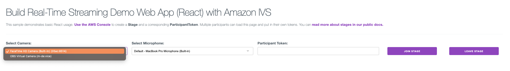

### 7. Set up and initialize the stage

- a. In `page.js`, set up `state` and `reference` variables to manage the current `stage`, `connection status`, `participant list`, and `local participant` information.

  **`src/app/page.js`**

  ```src/app/page.js

    ...

    // Initialize state variables for managing the current stage, connection status, participant list, and local participant information
    const [isConnected, setIsConnected] = useState(false); // Tracks the connection status
    const [participants, setParticipants] = useState([]); // Manages the list of participants
    const [localParticipant, setLocalParticipant] = useState({}); // Manages the local participant information

    // Create a ref for the stage to hold a reference to the IVS stage instance.
    const stageRef = useRef(undefined);

    // Create a ref for the strategy to hold a reference to the strategy configuration used in the IVS stage.
    const strategyRef = useRef();

    ...

  ```

- b. Initialize `state` variables to manage the `muted status` of the microphone and the `visibility status` of the camera in `page.js`.

  **`src/app/page.js`**

  ```src/app/page.js
      ...

      // Initialize a state variable to manage the muted status of the microphone
      const [isMicMuted, setIsMicMuted] = useState(true);

      // Initialize a state variable to manage the visibility status of the camera
      const [isCameraHidden, setIsCameraHidden] = useState(false);

      ...
  ```

- c. Here are the files you need to create inside the components folder: `Video.js`, `LocalParticipantVideo.js`, and `RemoteParticipantVideos.js`. Place the provided code in each of these files accordingly.

  - `Video.js` component is used to display a video element for a [participant](https://docs.aws.amazon.com/ivs/latest/RealTimeAPIReference/API_Participant.html), including their username and a pill-shaped overlay with either the participant's name or a default username. The component takes in various props, such as the class name, participant information, streams to display, username, and the participant's size.

  **`src/app/component/Video.js`**

  ```src/app/component/Video.js
    const Video = ({
      className,
      participant,
      streamsToDisplay,
      username,
      participantSize,
    }) => {
      return (
        <div className="relative">
          <video
            key={participant?.id}
            muted
            autoPlay
            playsInline
            className={className}
            ref={(ref) => {
              if (ref) {
                ref.srcObject = new MediaStream();
                streamsToDisplay?.forEach((stream) =>
                  ref.srcObject.addTrack(stream.mediaStreamTrack)
                );
              }
            }}
          />
          <div className="overlay-pill">
            {username ? username : `user-${participantSize}`}
          </div>
        </div>
      );
    };

    export default Video;
  ```

  - `LocalParticipantVideo.js` component is responsible for displaying the local participant's video stream. It takes in various props such as `isInitializeComplete`, `localParticipantInfo`, and `participantSize` and renders the local participant's video along with the participant's username and video streams to display.

  **`src/app/component/LocalParticipantVideo.js`**

  ```src/app/component/LocalParticipantVideo.js
    import Video from "./Video";

    const LocalParticipantVideo = ({
      isInitializeComplete,
      localParticipantInfo,
      participantSize,
    }) => {
      if (!isInitializeComplete) return;

      const { participant, streams } = localParticipantInfo;
      const { username } = participant?.attributes;

      let streamsToDisplay = streams;

      const { StreamType } = IVSBroadcastClient;
      streamsToDisplay = streams.filter(
        (stream) => stream?.streamType === StreamType?.VIDEO
      );

      return (
        <div className="video-container">
          <div className="column">
            <h3>Local Participant</h3>
            <Video
              className="local-video"
              participant={participant}
              streamsToDisplay={streamsToDisplay}
              username={username}
              participantSize={participantSize}
            />
          </div>
        </div>
      );
    };

    export default LocalParticipantVideo;
  ```

- `RemoteParticipantVideos.js` component essentially handles the rendering of remote participant videos, filtering out the local participant and displaying each remote participant's video with their corresponding username.

**`src/app/component/RemoteParticipantVideos.js`**

```src/app/component/RemoteParticipantVideos.js
  import Video from "./Video"; // Import the Video component

  const RemoteParticipantVideos = ({
    isInitializeComplete, // Boolean indicating if the initialization is complete
    participants, // Array of participants
    participantSize, // Size of the participant
  }) => {
    if (!isInitializeComplete) return; // If initialization is not complete, return

    return participants // Filter the participants that are not local and map each participant
      ?.filter(
        (participantAndStreamInfo) =>
          !participantAndStreamInfo.participant.isLocal // Filter out the local participants
      )
      .map((participantAndStreamInfo, index) => {
        const { participant, streams } = participantAndStreamInfo; // Destructure the participant and streams
        const { username } = participant?.attributes; // Destructure the username from the participant attributes
        let streamsToDisplay = streams; // Initialize streamsToDisplay with the remote streams

        return (
          <div className="flex margin" key={participant?.id}>
            {/* Container for the remote participant videos */}
            <div className="video-container" key={participant?.id}>
              {/* Video container for the remote participant */}
              {/* Render the Video component with necessary props */}
              <Video
                className="remote-participant-video" // CSS class for the remote participant video
                participant={participant} // Pass the participant information
                streamsToDisplay={streamsToDisplay} // Pass the streams to display
                username={username} // Pass the username
                participantSize={index+1} // Pass the the index
                key={participant?.id}
              />
            </div>
          </div>
        );
      });
  };

  export default RemoteParticipantVideos;

```

- d. In the return code block of `page.js`, implement buttons for `joining` and `leaving` a `stage` that will only render after the IVS Broadcast Client initialization. These buttons are not functional yet, and further instructions will follow in the next section.

  **`src/app/page.js`**

  ```src/app/page.js
    ...

    {isInitializeComplete && (
      <div className="button-container row">
        <button
          className="button"
        >
          Join Stage
        </button>
        <button
          className="button"
        >
          Leave Stage
        </button>
      </div>
    )}
  ```

- e. In the `page.js` return code block under the join and leave stage buttons, render the `LocalParticipantVideo` and `RemoteParticipantVideos` components based on the `isConnected` state, indicating whether the user has successfully connected to a stage.

  **`src/app/page.js`**

  ```src/app/page.js

    ...

    {isConnected && ( <>
        <h3>Local Participant</h3>
        <LocalParticipantVideo
          localParticipantInfo={localParticipant}
          isInitializeComplete={isInitializeComplete}
          participantSize={participants.length}
        />
      </>
    )}
    {isConnected && (
      <>
        <h3>Remote Participants</h3>{" "}
        <div className="center">
          <RemoteParticipantVideos
            isInitializeComplete={isInitializeComplete}
            participants={participants}
            participantSize={participants.length}
          />
        </div>
      </>
    )}

    ...

  ```

- f. Lastly, add the `Mute` and `Hide camera` control buttons based on the value of the `isConnected` variable just below the `LocalParticipantVideo`. The buttons are responsible for toggling the microphone and camera functionalities, with their text dynamically changing according to the current state of the microphone and camera settings.

**`src/app/page.js`**

```src/app/page.js

  ...

    {isConnected && (
      <div className="static-controls">
        <button
          onClick={() =>
            handleMediaToggle(MIC, stageRef, setIsMicMuted)
          }
          className="button"
        >
          {isMicMuted ? "Unmute Mic" : "Mute Mic"}
        </button>
        <button
          onClick={() =>
            handleMediaToggle(CAMERA, stageRef, setIsCameraHidden)
          }
          className="button"
        >
          {isCameraHidden ? "Unhide Camera" : "Hide Camera"}
        </button>
      </div>
    )}

  ...

```

> [!IMPORTANT]
> Your `page.js` file should now look like this:

**`src/app/page.js`**

```src/app/page.js
  "use client";
  import { useState, useRef } from "react";
  import Script from "next/script";

  import {
    getDevices,
    MIC,
    CAMERA,
  } from "./utils/mediaDevices";

  import Header from "./components/Header";
  import Input from "./components/Input";
  import LocalParticipantVideo from "./components/LocalParticipantVideo";
  import RemoteParticipantVideos from "./components/RemoteParticipantVideos";
  import Select from "./components/Select";

  export default function Home() {
    // Initializing a state variable and its update function
    const [isInitializeComplete, setIsInitializeComplete] = useState(false);

    // Using the useState hook to create and manage state for video and audio devices and their selections
    const [videoDevices, setVideoDevices] = useState([]); // Stores the available video devices
    const [audioDevices, setAudioDevices] = useState([]); // Stores the available audio devices
    const [selectedVideoDeviceId, setSelectedVideoDeviceId] = useState(null); // Tracks the selected video device
    const [selectedAudioDeviceId, setSelectedAudioDeviceId] = useState(null); // Tracks the selected audio device

    const [participantToken, setParticipantToken] = useState("");

    // Initialize state variables for managing the current stage, connection status, participant list, and local participant information
    const [isConnected, setIsConnected] = useState(false); // Tracks the connection status
    const [participants, setParticipants] = useState([]); // Manages the list of participants
    const [localParticipant, setLocalParticipant] = useState({}); // Manages the local participant information

    // Create a ref for the stage to hold a reference to the IVS stage instance.
    const stageRef = useRef(undefined);

    // Create a ref for the strategy to hold a reference to the strategy configuration used in the IVS stage.
    const strategyRef = useRef();

    // Initialize a state variable to manage the muted status of the microphone
    const [isMicMuted, setIsMicMuted] = useState(true);

    // Initialize a state variable to manage the visibility status of the camera
    const [isCameraHidden, setIsCameraHidden] = useState(false);

    const handleDeviceUpdate = async () => {
      try {
        const { videoDevices, audioDevices } = await getDevices();
        setVideoDevices(videoDevices);
        setSelectedVideoDeviceId(videoDevices[0]?.deviceId);

        setAudioDevices(audioDevices);
        setSelectedAudioDeviceId(audioDevices[0]?.deviceId);
      } catch (error) {
        // Handle any errors that may occur during the device update process
        console.error("An error occurred during device update:", error);
        // You can add additional error-handling logic here as needed
      }
    };

    const initialize = async () => {
      handleDeviceUpdate();
      setIsInitializeComplete(true);
    };

    return (
      <div>
        <Script
          src="https://web-broadcast.live-video.net/1.6.0/amazon-ivs-web-broadcast.js" // Load the Amazon IVS Web Broadcast JavaScript library
          onLoad={initialize} // Call the 'initialize' function after the script has loaded
        ></Script>
        <Header />
        <hr />
        <div className="row">
          <Select
            deviceType="Camera"
            updateDevice={setSelectedVideoDeviceId}
            devices={videoDevices}
          />
          <Select
            deviceType="Microphone"
            updateDevice={setSelectedAudioDeviceId}
            devices={audioDevices}
          />
          <Input
            label="Participant Token"
            value={participantToken}
            onChange={setParticipantToken}
          />
          {isInitializeComplete && (
            <div className="button-container row">
              <button
                className="button"
              >
                Join Stage
              </button>
              <button
                className="button"
              >
                Leave Stage
              </button>
            </div>
          )}
          <br />
        </div>
        {isConnected && (
          <>
            <h3>Local Participant</h3>
            <LocalParticipantVideo
              localParticipantInfo={localParticipant}
              isInitializeComplete={isInitializeComplete}
              participantSize={participants.length}
            />
          </>
        )}
        {isConnected && (
          <div className="static-controls">
            <button
              onClick={() =>
                handleMediaToggle(MIC, stageRef, setIsMicMuted)
              }
              className="button"
            >
              {isMicMuted ? "Unmute Mic" : "Mute Mic"}
            </button>
            <button
              onClick={() =>
                handleMediaToggle(CAMERA, stageRef, setIsCameraHidden)
              }
              className="button"
            >
              {isCameraHidden ? "Unhide Camera" : "Hide Camera"}
            </button>
          </div>
        )}
        {isConnected && (
          <>
            <h3>Remote Participants</h3>{" "}
            <div className="center">
              <RemoteParticipantVideos
                isInitializeComplete={isInitializeComplete}
                participants={participants}
                participantSize={participants.length}
              />
            </div>
          </>
        )}
      </div>
      );
    }
```

**Open your web browser and ensure that it resembles this:**

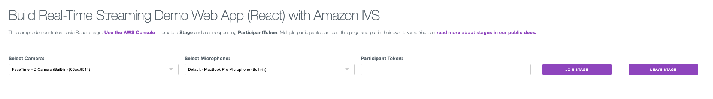

### 8. Handle joining the stage and controlling the stream

- a. Create a file named `stagesUtils.js` inside the `utils` folder to manage all the logic related to the stages.

> [!IMPORTANT]
> Your file structure should now look like this:

```
hello-world
│
└───client
│   │   .eslintrc.json
│   │   package.json
│   │   jsconfig.json
│   │   next.config.js
│   │
│   │
│   └───src
│       └───app
│           └───components
│                 Header.js
│                 Input.js
│                 Select.js
│           └───utils
│                 mediaDevices.js
│                 stageUtils.js
│           layout.js
            page.js
            globals.css
```

- b. To set up our stage, we'll import necessary functions from the `mediaDevices.js` file.

  **`src/app/utils/stageUtils.js`**

  ```src/app/utils/stageUtils.js
    import { getMediaForDevices, CAMERA, MIC } from "./mediaDevices";
  ```

- c. Create a function, `createLocalStageStream`, to generate a local stage stream using the given device ID and type (`CAMERA` or `MIC`).

  **`src/app/utils/stageUtils.js`**

  ```src/app/utils/stageUtils.js

    ...

    export const createLocalStageStream = async (deviceId, deviceType) => {
      const { LocalStageStream } = IVSBroadcastClient;

      // Warn and return if the device ID is null
      if (!deviceId) {
        console.warn("Attempted to set local media with a null device ID");
        return;
      }

      // Get media stream for the specified device
      const newDevice = await getMediaForDevices(deviceId, deviceType);

      // Create a LocalStageStream based on the device type
      const stageStream = deviceType === CAMERA
        ? new LocalStageStream(newDevice.getVideoTracks()[0])
        : new LocalStageStream(newDevice.getAudioTracks()[0]);

      return stageStream;
    };
  ```

- d. Create a `setupStrategy` function that generates a [`strategy`](https://aws.github.io/amazon-ivs-web-broadcast/docs/v1.4.0/sdk-guides/stages#strategy) object for [IVS stage](https://aws.github.io/amazon-ivs-web-broadcast/docs/real-time-sdk-guides/stages#stage), handling initialization status. The `strategy` includes methods to `update audio` and `video tracks`, define [`streams to publish`](https://aws.github.io/amazon-ivs-web-broadcast/docs/real-time-sdk-guides/stages#publish-a-media-stream), determine [`participant publishing`](https://aws.github.io/amazon-ivs-web-broadcast/docs/real-time-sdk-guides/stages#display-and-remove-participants), `subscribe to participants`, and `stop tracks`.

  **`src/app/utils/stageUtils.js`**

  ```src/app/utils/stageUtils.js

    ...

    // Function creates a strategy object for IVS stage, considering initialization status
    const setupStrategy = (
      isInitializeComplete // Parameter representing the initialization completion status
    ) => {
      // Check if the initialization is complete; if not, return nothing
      if (!isInitializeComplete) {
        return;
      }

      const { SubscribeType } = IVSBroadcastClient; // Reference the SubscribeType property from the IVSBroadcastClient object
      // More information can be found here: https://aws.github.io/amazon-ivs-web-broadcast/docs/v1.3.1/sdk-reference/enums/SubscribeType?_highlight=subscribetype

      const strategy = {
        audioTrack: undefined,
        videoTrack: undefined,

        // Method to update audio and video tracks
        updateTracks(newAudioTrack, newVideoTrack) {
          this.audioTrack = newAudioTrack;
          this.videoTrack = newVideoTrack;
        },

        // Method to define streams to publish
        stageStreamsToPublish() {
          return [this.audioTrack, this.videoTrack];
        },

        // Method to determine participant publishing
        shouldPublishParticipant(participant) {
          return true;
        },

        // Method to determine type of subscription for participants
        shouldSubscribeToParticipant(participant) {
          return SubscribeType.AUDIO_VIDEO;
        },
      };

      return strategy; // Return the strategy object
    };

  ```

- e. Within the `statesUtils.js` file, add a `joinStage` function with properties including `isInitializeComplete`, `selectedVideoDeviceId`, `selectedAudioDeviceId`, `participantToken`, `setIsMicMuted`, `setLocalParticipant`, `setParticipants`, `stageRef`, `strategyRef`, and `setIsConnected` to facilitate the joining of the stage.

  **`src/app/utils/stageUtils.js`**

  ```src/app/utils/stageUtils.js

    ...

    export const joinStage = async (
      isInitializeComplete, // Indicates if the initialization is complete
      participantToken, // Token of the participant
      selectedAudioDeviceId, // Represents the selected audio device
      selectedVideoDeviceId, // Represents the selected video device
      setIsConnected, // Setter for the connection status
      setIsMicMuted, // Setter for the microphone mute state
      setLocalParticipant, // Setter for the local participant
      setParticipants, // Setter for the list of participants
      strategyRef,
      stageRef // Setter for the stage
    ) => {}
  ```

- f. Inside of the `joinStage` function, you need to fetch all the necessary methods from the `IVSBroadcastClient` to initiate a stage.

\*Note: For a comprehensive guide on available methods in the SDK, visit the [Amazon IVS Web Broadcast SDK Reference](https://aws.github.io/amazon-ivs-web-broadcast/docs/v1.3.1/sdk-reference).

**`src/app/utils/stageUtils.js`**

```src/app/utils/stageUtils.js

  ...

  export const joinStage = async (
       isInitializeComplete,
       selectedVideoDeviceId,
       selectedAudioDeviceId,
       participantToken,
       setIsMicMuted,
       setLocalParticipant,
       setParticipants,
       setStage,
       setIsConnected
     ) => {
      const {
         Stage,
         StageEvents,
         ConnectionState,
       } = IVSBroadcastClient;
     }
```

- g. Within the `joinStage` function, ensure `IVS Broadcast Client` is initialized and fetch selected video and audio `LocalStageStreams` by using `createLocalStageStream` function.

  **`src/app/utils/stageUtils.js`**

  ```src/app/utils/stageUtils.js

    ...

    if (!isInitializeComplete) return; // If the initialization is not complete, stop execution and return

    const cameraStageStream = await createLocalStageStream(
      selectedVideoDeviceId,
      CAMERA
    );
    const micStageStream = await createLocalStageStream(selectedAudioDeviceId, MIC);
  ```

- h. Next, inside the `joinStage` function, create a [`strategy`](https://aws.github.io/amazon-ivs-web-broadcast/docs/v1.4.0/sdk-guides/stages#strategy) for the stage using our `setupStrategy` function.

  **`src/app/utils/stageUtils.js`**

  ```src/app/utils/stageUtils.js

    ...

    // Set up the strategy for the stage
    const strategy = setupStrategy(isInitializeComplete);

  ```

- i. Call the `updateTracks` method on the `strategy` object and pass in two arguments: `micStageStream` and `cameraStageStream`. This method will update or set the `audio` and `video` tracks within the `strategy`. Set [`strategyRef.current`](https://react.dev/reference/react/useRef) to the newly created `strategy`.

  **`src/app/utils/stageUtils.js`**

  ```src/app/utils/stageUtils.js

    ...

    // Set up the strategy for the stage
    strategy.updateTracks(micStageStream, cameraStageStream);
    strategyRef.current = strategy;
  ```

- j. Inside the `joinStage` function, create a new [stage](https://aws.github.io/amazon-ivs-web-broadcast/docs/v1.4.0/sdk-guides/stages#stage) instance.

  **`src/app/utils/stageUtils.js`**

  ```src/app/utils/stageUtils.js

    ...

    let stage = new Stage(participantToken, strategy);
  ```

> [!IMPORTANT]
> Your `joinStage` function should now appear as follows:

**`src/app/utils/stageUtils.js`**

```src/app/utils/stageUtils.js
    export const joinStage = async (
      isInitializeComplete, // Indicates if the initialization is complete
      participantToken, // Token of the participant
      selectedAudioDeviceId, // Represents the selected audio device
      selectedVideoDeviceId, // Represents the selected video device
      setIsConnected, // Setter for the connection status
      setIsMicMuted, // Setter for the microphone mute state
      setLocalParticipant, // Setter for the local participant
      setParticipants, // Setter for the list of participants
      strategyRef,
      stageRef // Setter for the stage
    ) => {
    const {
      Stage, // Reference to the Stage class
      StageEvents, // Reference to the StageEvents object
      ConnectionState, // Reference to the ConnectionState object
    } = IVSBroadcastClient; // IVS Broadcast Client object

    if (!isInitializeComplete) return; // If the initialization is not complete, stop execution and return

    const cameraStageStream = await createLocalStageStream(
      selectedVideoDeviceId,
      CAMERA
    );
    const micStageStream = await createLocalStageStream(selectedAudioDeviceId, MIC);

    // Set up the strategy for the stage
    const strategy = setupStrategy(isInitializeComplete);

    strategy.updateTracks(micStageStream, cameraStageStream);

    strategyRef.current = strategy;

    // Create a new stage instance
    let stage = new Stage(participantToken, strategyRef.current);
    };
```

- k. Add a `updateLocalParticipantMedia` function to `page.js` to efficiently update tracks when users switch their audio or video devices.

  - `updateLocalParticipantMedia` generates new video and audio streams for the local participant when switching audio or video devices.

    **`src/app/page.js`**

    ```src/app/page.js

      ...

      const updateLocalParticipantMedia = async () => {
        const { participant, streams } = localParticipant;

        // Create new local streams
        const newVideoStream = await createLocalStageStream(
          selectedVideoDeviceId,
          CAMERA
        );
        const newAudioStream = await createLocalStageStream(
          selectedAudioDeviceId,
          MIC
        );

        // Update the streams array with the new streams
        const updatedStreams = [newVideoStream, newAudioStream];

        // Update the participant object with the new streams
        const updatedParticipant = {
          participant,
          streams: updatedStreams,
        };

        setLocalParticipant(updatedParticipant);

        strategyRef.current.updateTracks(newAudioStream, newVideoStream);
        stageRef.current.refreshStrategy();
      };

      ...

    ```

    - This [`useEffect`](https://react.dev/reference/react/useEffect) updates the participant's stream array, sets the updated state, and triggers `strategy` and `stage` updates, ensuring the application reflects changes in the `local media tracks`.

      **`src/app/page.js`**

      ```src/app/page.js

      ...

        useEffect(() => {
          //Check to ensure that the stage and the strategy have completed initialization
          const isInitializingStreams =
            !strategyRef.current?.audioTrack && !strategyRef.current?.videoTrack;
          if (!isInitializeComplete || isInitializingStreams) return; // If initialization is not complete, return

          if (localParticipant.streams) {
            updateLocalParticipantMedia();
          }
        }, [selectedVideoDeviceId, selectedAudioDeviceId]);
        ...

      ```

- l. Establish [event listeners](https://aws.github.io/amazon-ivs-web-broadcast/docs/v1.4.0/sdk-guides/stages#events) inside of the `joinStage` function for the stage, covering events like `connection state changes`, `participant stream additions`, and `participant leaving`.

  - `STAGE_CONNECTION_STATE_CHANGED`: When the connection state changes, the `isConnected` state changes, and the participants microphone is automatically muted to prevent potential infinite feedback loops when a user enters the stage.

  **`src/app/utils/stageUtils.js`**

  ```src/app/utils/stageUtils.js

      ...

      stage.on(StageEvents.STAGE_CONNECTION_STATE_CHANGED, (state) => {
        setIsConnected(state === ConnectionState.CONNECTED);

        // Mutes the microphone stage stream and updates the inner text of the mic button to "Unmute Mic"
        micStageStream.setMuted(true);
        setIsMicMuted(true);
      });
  ```

  - `STAGE_PARTICIPANT_STREAMS_ADDED`: It logs information about the added participant's media, updates the local participant, and adds the participant and their streams to the list of participants.

  ```src/app/utils/stageUtils.js

      ...

      stage.on(
        StageEvents.STAGE_PARTICIPANT_STREAMS_ADDED,
        (participant, streams) => {
          console.log("Participant Media Added: ", participant, streams);

          if (participant.isLocal) {
            setLocalParticipant({ participant, streams });
          }
                setParticipants((prevParticipants) => {
        const participantExists = prevParticipants.some(
          (participantObj) => participantObj.participant.id === participant.id
        );

        if (!participantExists) {
          return [...prevParticipants, { participant, streams }];
        } else {
          return prevParticipants;
        }
      });
        }
      );
  ```

  - `STAGE_PARTICIPANT_LEFT`: It logs information about the participant who left and updates the list of participants by removing the participant who left.

  ```src/app/utils/stageUtils.js

      ...

      stage.on(StageEvents.STAGE_PARTICIPANT_LEFT, (participant) => {
        console.log("Participant Left: ", participant);

        setParticipants((prevParticipants) => {
          const filteredParticipants = prevParticipants.filter(
            ({ participant: currentParticipant }) => {
              return currentParticipant.id !== participant.id;
            }
          );
          return [...filteredParticipants];
        });
      });
  ```

- m. Create a try-catch block that tries to [join the stage](https://aws.github.io/amazon-ivs-web-broadcast/docs/v1.4.0/sdk-guides/stages#concepts), and if an error occurs during the process, it handles the error and resets the joining and connected flags accordingly.

  **`src/app/utils/stageUtils.js`**

  ```src/app/utils/stageUtils.js

    ...

    try {
      await stage.join();
    } catch (err) {
      stage = null;
    }
  ```

- n. Update the reference variable `stageRef` with the value of the local variable `stage`.

  **`src/app/utils/stageUtils.js`**

  ```src/app/utils/stageUtils.js

  ...

  stageRef.current = stage;
  ```

> [!IMPORTANT]
> Your `joinStage` function should now appear as follows:

**`src/app/utils/stageUtils.js`**

```src/app/utils/stageUtils.js
    export const joinStage = async (
      isInitializeComplete, // Indicates if the initialization is complete
      participantToken, // Token of the participant
      selectedAudioDeviceId, // Represents the selected audio device
      selectedVideoDeviceId, // Represents the selected video device
      setIsConnected, // Setter for the connection status
      setIsMicMuted, // Setter for the microphone mute state
      setLocalParticipant, // Setter for the local participant
      setParticipants, // Setter for the list of participants
      strategyRef,
      stageRef // Setter for the stage
    ) => {
      const {
        Stage, // Reference to the Stage class
        StageEvents, // Reference to the StageEvents object
        ConnectionState, // Reference to the ConnectionState object
      } = IVSBroadcastClient; // IVS Broadcast Client object

      if (!isInitializeComplete) return; // If the initialization is not complete, stop execution and return

      const cameraStageStream = await createLocalStageStream(
        selectedVideoDeviceId,
        CAMERA
      );
      const micStageStream = await createLocalStageStream(selectedAudioDeviceId, MIC);

      // Set up the strategy for the stage
      const strategy = setupStrategy(isInitializeComplete);

      strategy.updateTracks(micStageStream, cameraStageStream);

      strategyRef.current = strategy;

      // Create a new stage instance
      let stage = new Stage(participantToken, strategyRef.current);

      // Event listener for stage connection state changes
      stage.on(StageEvents.STAGE_CONNECTION_STATE_CHANGED, (state) => {
        // Update the connection status
        setIsConnected(state === ConnectionState.CONNECTED);

        // Mute the microphone stage stream and update the state for the mic button
        micStageStream.setMuted(true);
        setIsMicMuted(true);
      });

      // Event listener for when participant streams are added
      stage.on(
        StageEvents.STAGE_PARTICIPANT_STREAMS_ADDED,
        (participant, streams) => {
          console.log("Participant Media Added: ", participant, streams);

          // Set the local participant and update the list of participants
          if (participant.isLocal) {
            setLocalParticipant({ participant, streams });
          }
                setParticipants((prevParticipants) => {
        const participantExists = prevParticipants.some(
          (participantObj) => participantObj.participant.id === participant.id
        );

        if (!participantExists) {
          return [...prevParticipants, { participant, streams }];
        } else {
          return prevParticipants;
        }
      });
        }
      );

      // Event listener for when a participant leaves
      stage.on(StageEvents.STAGE_PARTICIPANT_LEFT, (participant) => {
        console.log("Participant Left: ", participant);

        // Update the list of participants by removing the participant who left
        setParticipants((prevParticipants) => {
          const filteredParticipants = prevParticipants.filter(
            ({ participant: currentParticipant }) => {
              return currentParticipant.id !== participant.id;
            }
          );
          return [...filteredParticipants];
        });
      });

      try {
        await stage.join(); // Attempt to join the stage
      } catch (err) {
        stage = null;
      }

      stageRef.current = stage;
    };
```

- o. Lastly, In the `page.js` file, assign the `joinStage` function to the Join Stage button's `onClick` event, passing in the required states and functions as parameters.

  **`src/app/page.js`**

  ```src/app/page.js

    import { joinStage } from "./utils/stageUtils";

    ...

      <button
        className="button"
        onClick={() =>
          joinStage(
            isInitializeComplete,
            participantToken,
            selectedAudioDeviceId,
            selectedVideoDeviceId,
            setIsConnected,
            setIsMicMuted,
            setLocalParticipant,
            setParticipants,
            strategyRef,
            stageRef
          )
        }
      >
        Join Stage
      </button>
  ```

**You should now be able to join a stage.**

### 9. Manage the departure of participants from the stage

- a. Navigate to the `stageUtils.js` file and at the bottom of the page add a `leaveStage` function that is responsible for disconnecting the current `participant` from the `stage` and updating the connection status to reflect the disconnection.

  **`src/app/utils/stageUtils.js`**

  ```src/app/utils/stageUtils.js

    ...

    export const leaveStage = async (stage, setIsConnected) => {
      await stage.leave();
      setIsConnected(false);
    };
  ```

- b. In the `page.js` file, assign the `leaveStage` function to the Leave Stage button's `onClick` event, passing in the required states and functions as parameters.

  **`src/app/page.js`**

  ```src/app/page.js

    import { joinStage, leaveStage } from "./utils/stageUtils";

    ...

    <button
      className="button"
      onClick={() => leaveStage(stageRef.current, setIsConnected)}
    >
      Leave Stage
    </button>
  ```

> [!IMPORTANT]
> Your `page.js` file should now look like this:

**`src/app/page.js`**

```src/app/page.js
"use client";
import { useState, useEffect, useRef } from "react";
import Script from "next/script";

import {
  getDevices,
  handleMediaToggle,
  MIC,
  CAMERA,
} from "./utils/mediaDevices";
import {
  leaveStage,
  joinStage,
  createLocalStageStream,
} from "./utils/stageUtils";

import Header from "./components/Header";
import Input from "./components/Input";
import LocalParticipantVideo from "./components/LocalParticipantVideo";
import RemoteParticipantVideos from "./components/RemoteParticipantVideos";
import Select from "./components/Select";

export default function Home() {
  // Initializing a state variable and its update function
  const [isInitializeComplete, setIsInitializeComplete] = useState(false);

  // Using the useState hook to create and manage state for video and audio devices and their selections
  const [videoDevices, setVideoDevices] = useState([]); // Stores the available video devices
  const [audioDevices, setAudioDevices] = useState([]); // Stores the available audio devices
  const [selectedVideoDeviceId, setSelectedVideoDeviceId] = useState(null); // Tracks the selected video device
  const [selectedAudioDeviceId, setSelectedAudioDeviceId] = useState(null); // Tracks the selected audio device

  // Initialize state for the participant token as an empty string
  const [participantToken, setParticipantToken] = useState("");

  // Initialize state variables for managing the current stage, connection status, participant list, and local participant information
  const [isConnected, setIsConnected] = useState(false); // Tracks the connection status
  const [participants, setParticipants] = useState([]); // Manages the list of participants
  const [localParticipant, setLocalParticipant] = useState({}); // Manages the local participant information

  // Create a ref for the stage to hold a reference to the IVS stage instance.
  const stageRef = useRef(undefined);

  // Create a ref for the strategy to hold a reference to the strategy configuration used in the IVS stage.
  const strategyRef = useRef();

  // Initialize a state variable to manage the muted status of the microphone
  const [isMicMuted, setIsMicMuted] = useState(true);

  // Initialize a state variable to manage the visibility status of the camera
  const [isCameraHidden, setIsCameraHidden] = useState(false);

  /**
  * Function gets the video and audio devices connected to the laptop and stores them in the state
  */
  const handleDeviceUpdate = async () => {
    try {
      const { videoDevices, audioDevices } = await getDevices();
      setVideoDevices(videoDevices);
      setSelectedVideoDeviceId(videoDevices[0]?.deviceId);

      setAudioDevices(audioDevices);
      setSelectedAudioDeviceId(audioDevices[0]?.deviceId);
    } catch (error) {
      // Handle any errors that may occur during the device update process
      console.error("An error occurred during device update:", error);
      // You can add additional error-handling logic here as needed
    }
  };

  /**
  * Initialize after the client is loaded
  */
  const initialize = async () => {
    // Call the handleDeviceUpdate function to update the video and audio devices
    handleDeviceUpdate();
    // Set the value of isInitializeComplete to true
    setIsInitializeComplete(true);
  };

  const updateLocalParticipantMedia = async () => {
    const { participant } = localParticipant;

    // Create new local streams
    const newVideoStream = await createLocalStageStream(
      selectedVideoDeviceId,
      CAMERA
    );
    const newAudioStream = await createLocalStageStream(
      selectedAudioDeviceId,
      MIC
    );

    // Update the streams array with the new streams
    const updatedStreams = [newVideoStream, newAudioStream];

    // Update the participant object with the new streams
    const updatedParticipant = {
      participant,
      streams: updatedStreams,
    };

    setLocalParticipant(updatedParticipant);

    strategyRef.current.updateTracks(newAudioStream, newVideoStream);
    stageRef.current.refreshStrategy();
  };

  useEffect(() => {
    //Check to ensure that the stage and the strategy have completed initialization
    const isInitializingStreams =
      !strategyRef.current?.audioTrack && !strategyRef.current?.videoTrack;
    if (!isInitializeComplete || isInitializingStreams) return; // If initialization is not complete, return

    if (localParticipant.streams) {
      updateLocalParticipantMedia();
    }
  }, [selectedVideoDeviceId, selectedAudioDeviceId]);

  return (
    <div>
      <Script
        src="https://web-broadcast.live-video.net/1.6.0/amazon-ivs-web-broadcast.js" // Load the Amazon IVS Web Broadcast JavaScript library
        onLoad={initialize} // Call the 'initialize' function after the script has loaded
      ></Script>
      <Header />
      <hr />
      <div className="row">
        <Select
          deviceType="Camera"
          updateDevice={setSelectedVideoDeviceId}
          devices={videoDevices}
        />
        <Select
          deviceType="Microphone"
          updateDevice={setSelectedAudioDeviceId}
          devices={audioDevices}
        />
        <Input
          label="Participant Token"
          value={participantToken}
          onChange={setParticipantToken}
        />
        {isInitializeComplete && (
          <div className="button-container row">
            <button
              className="button"
              onClick={() =>
                joinStage(
                  isInitializeComplete,
                  participantToken,
                  selectedAudioDeviceId,
                  selectedVideoDeviceId,
                  setIsConnected,
                  setIsMicMuted,
                  setLocalParticipant,
                  setParticipants,
                  strategyRef,
                  stageRef
                )
              }
            >
              Join Stage
            </button>
            <button
              className="button"
              onClick={() => leaveStage(stageRef.current, setIsConnected)}
            >
              Leave Stage
            </button>
          </div>
        )}
        <br />
      </div>
      {isConnected && (
        <>
          <h3>Local Participant</h3>
          <LocalParticipantVideo
            localParticipantInfo={localParticipant}
            isInitializeComplete={isInitializeComplete}
            participantSize={participants.length}
          />
        </>
      )}
      {isConnected && (
        <div className="static-controls">
          <button
            onClick={() =>
              handleMediaToggle(MIC, stageRef.current, setIsMicMuted)
            }
            className="button"
          >
            {isMicMuted ? "Unmute Mic" : "Mute Mic"}
          </button>
          <button
            onClick={() =>
              handleMediaToggle(CAMERA, stageRef, setIsCameraHidden)
            }
            className="button"
          >
            {isCameraHidden ? "Unhide Camera" : "Hide Camera"}
          </button>
        </div>
      )}
      {isConnected && (
        <>
          <h3>Remote Participants</h3>{" "}
          <div className="center">
            <RemoteParticipantVideos
              isInitializeComplete={isInitializeComplete}
              participants={participants}
              participantSize={participants.length}
            />
          </div>
        </>
      )}
    </div>
  );
}
```

### 10. Generate tokens for participants and facilitate them joining a stage

- a. Now, navigate back to stages inside of your AWS console (Amazon IVS > Real-time streaming > stages) and click on your newly created stage from [step 4](https://github.com/Four-Nine-Digital/ivs-code-samples/tree/main/real-time-streaming/hello-world/web/hello-world-reactjs#4-create-a-stage-from-the-aws-console).


- b. To initiate and join the stage, you must generate a [participant token](https://docs.aws.amazon.com/ivs/latest/RealTimeAPIReference/API_ParticipantToken.html) for access. Click into your newly created stage and find the header "Participant tokens". Beside this header click the "Create a participant token" button:


- c. Create a participant token by completing the required information.

  - Under UserId: Enter any UTF-8 encoded text up to 128 characters long.
  - Under Capabilities: Choose both publish and subscribe/
  - Under Token duration: if you want to specify a duration, you can do it here, otherwise the duration defaults to 720 min.
  - Under Attributes: To include supplementary data in your token, click 'add attribute' to provide a key-value pair. In this example, you should add the attribute with Key: `'username'` and Value: `'stageUser'`, which will display the username `'stageUser'` over the video if available.
    > ie. Key: username | Value: stageUser

  \*Note: In the absence of a provided `username` in the `token`, the overlay will display the participant's number within the stage as `'user-{participantSize}'`.

  **`src/app/components/Video.js`**

  ```src/app/components/Video.js

    ...

      <div className="overlay-pill">
        {username ? username : `user-${participantSize}`}
      </div>
  ```

  - Click "Create a participant token" at the bottom right hand corner of the modal.


- d. Once the token is created, copy and paste it into your application (you now have access to a token that you will need to join a stage):


### 11. Add multiple participants to a stage

- a. Create multiple participant tokens with desired configurations.

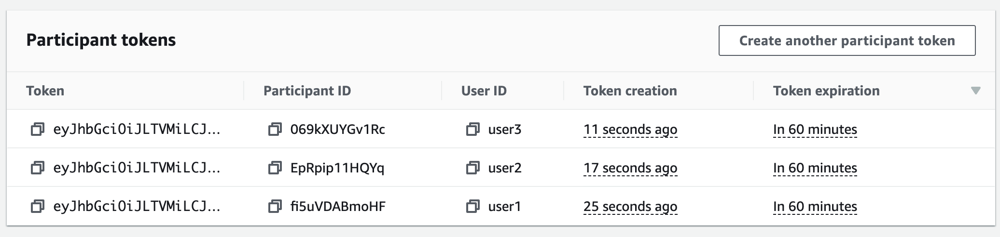

- b. Open two separate browsers, access the application, and insert different participant tokens into each.

- c. After choosing your desired camera and microphone for each browser, click "Join Stage" on each browser.

**Congratulations! You have successfully built a demo web application that enables real-time streaming among multiple participants using the Amazon IVS Web Broadcasting SDK.**


# Advanced features

## Create a dynamic grid layout for multiple participants on a stage

### Project Description

This is a demo web application intended as an educational tool for learning how to display participants in a dynamic and responsive Grid.
You will use the [CSS Grid Module](https://developer.mozilla.org/en-US/docs/Web/CSS/CSS_grid_layout) to layout the videos as it allows control over a video's horizontal and vertical position relative to other videos.

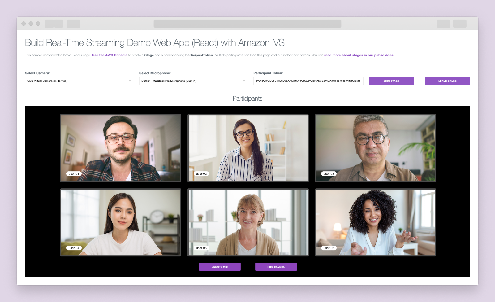

- a. Navigate from the `hello-world` folder to the `hello-world-with-grid-layout` folder by using the following commands:

  ```
  cd ..
  mkdir hello-world-with-grid-layout
  cd hello-world-with-grid-layout
  cd client
  ```

  - To install all necessary dependencies run, `npm install`
  - To initiate the application, `npm run dev`

The file structure and most of the code remain unchanged from the previous section, but you will be modifying specific sections to implement a grid layout.

> [!IMPORTANT]
> Your file structure should look like this:

```
hello-world-with-grid-layout
│
└───client
│   │   .eslintrc.json
│   │   package.json
│   │   jsconfig.json
│   │   next.config.js
│   │
│   │
│   └───src
│       └───app
│           └───components
│                 Header.js
│                 Input.js
│                 Select.js
│                 Video.js
│                 RemoteParticipantVideos.js
│                 LocalParticipantVideos.js
│           └───utils
│                 mediaDevices.js
│                 stageUtils.js
│           layout.js
            page.js
            globals.css
```

- b. Adjust `global.css` to construct a dynamic [grid layout](https://developer.mozilla.org/en-US/docs/Web/CSS/CSS_grid_layout/Basic_concepts_of_grid_layout) based on the number of participating stage members.

\*Note: Please refer to the `hello-world-with-grid-layout/src/app/global.css` for full codebase. You'll see the extra classes included in this file.

**`hello-world-with-grid-layout/src/app/global.css`**

```hello-world-with-grid-layout/src/app/global.css

    ...

    /* Grid definitions */

    /*! Allows the selected elements to be rendered as a grid container. */
    .grid {
      display: grid;
    }

    /*! Assigns the specified grid area name to the elements with the class .slot-,
    allowing them to be positioned within the defined grid template areas. */

    .slot-1 {
      grid-area: s-1;
    }

    .slot-2 {
      grid-area: s-2;
    }

    .slot-3 {
      grid-area: s-3;
    }

    ...

    /*! This CSS code defines a dynamic grid layout with adjustable columns and rows using
    the grid-template-columns and grid-template-rows properties, alongside the grid-template-areas property to designate an area identified as 's-'.
    This configuration allows for flexible grid arrangements tailored for elements with the class .grid- */

    .grid-1 {
      grid-template-columns: repeat(1, minmax(0, 1fr));
      grid-template-rows: repeat(1, minmax(0, 1fr));
      grid-template-areas: 's-1';
    }

    .grid-2 {
      grid-template-columns: repeat(2, minmax(0, 1fr));
      grid-template-rows: repeat(1, minmax(0, 1fr));
      grid-template-areas: 's-1 s-2';
    }

    .grid-3 {
      grid-template-columns: repeat(4, minmax(0, 1fr));
      grid-template-rows: repeat(2, minmax(0, 1fr));
      grid-template-areas:
        's-1 s-1 s-2 s-2'
        '... s-3 s-3 ...';
    }

    ...

```

\*Note: Refer to the documentation for grid layout functionality at [MDN CSS Grid Layout](https://developer.mozilla.org/en-US/docs/Web/CSS/CSS_grid_layout) and [CSS Tricks - Complete Guide to Grid](https://css-tricks.com/snippets/css/complete-guide-grid/) for more information.

- c. In a Grid layout, you consolidate the local and remote participant video containers into a single 'Participant Video' container within the `components` folder. In the `components` folder, create `ParticipantVideos.js` and implement code that iterates through all `participants`, extracting details such as usernames and streams. It renders a `Video` component for each `participant`, passing appropriate props like the participant's username and video streams.

  **`hello-world-with-grid-layout/src/app/components/ParticipantVideos.js`**

  ```hello-world-with-grid-layout/src/app/components/ParticipantVideos.js
    import Video from "./Video";

    const ParticipantVideos = ({
      isInitializeComplete, // Boolean indicating if the initialization is complete
      participants, // Array of participants
    }) => {
      if (!isInitializeComplete) return; // If initialization is not complete, return

      return participants
        ?.map((participantAndStreamInfo, index) => {
          const { participant, streams } = participantAndStreamInfo; // Destructure the participant and streams
          const { username } = participant?.attributes; // Destructure the username from the participant attributes
          let streamsToDisplay = streams; // Initialize streamsToDisplay with the remote streams

          return (
            <div className={`participant-grid-container slot-${index + 1}`}>
              {/* Video container for the participant */}
              {/* Render the Video component with necessary props */}
              <Video
                className={`remote-participant-video`} // CSS class for the remote participant video
                participant={participant} // Pass the participant information
                streamsToDisplay={streamsToDisplay} // Pass the streams to display
                username={username} // Pass the username
                participantSize={index + 1} // Pass the participant size
              />
            </div>
          );
        });
    };

    export default ParticipantVideos;
  ```

- d. In the `page.js` file, remove the `RemoteParticipantVideos.js` and `LocalParticipantVideos.js` components along with their imports. Additionally, delete the video controls components from the return block.

  **`hello-world-with-grid-layout/src/app/page.js`**

  ```hello-world-with-grid-layout/src/app/page.js

    ...

    return (
        <div>
          <Script
            src="https://web-broadcast.live-video.net/1.6.0/amazon-ivs-web-broadcast.js" // Load the Amazon IVS Web Broadcast JavaScript library
            onLoad={initialize} // Call the 'initialize' function after the script has loaded
          ></Script>
          <Header />
          <hr />
          <div className="row">
            <Select
              deviceType="Camera"
              updateDevice={setSelectedVideoDeviceId}
              devices={videoDevices}
            />
            <Select
              deviceType="Microphone"
              updateDevice={setSelectedAudioDeviceId}
              devices={audioDevices}
            />
            <Input
              label="Participant Token"
              value={participantToken}
              onChange={setParticipantToken}
            />
            {isInitializeComplete && (
              <div className="button-container row">
                <button
                  className="button margin-right"
                  onClick={() =>
                    joinStage(
                      isInitializeComplete,
                      selectedVideoDeviceId,
                      selectedAudioDeviceId,
                      participantToken,
                      setIsMicMuted,
                      setLocalParticipant,
                      setParticipants,
                      setStage,
                      setIsConnected
                    )
                  }
                >
                  Join Stage
                </button>
                <button
                  className="button"
                  onClick={() => leaveStage(stage, setIsConnected)}
                >
                  Leave Stage
                </button>
              </div>
            )}
            <br />
          </div>
        </div>
      );
  ```

> [!IMPORTANT]
> Your file structure should look like this:

```
hello-world-with-grid-layout
│
└───client
│   │   .eslintrc.json
│   │   package.json
│   │   jsconfig.json
│   │   next.config.js
│   │
│   │
│   └───src
│       └───app
│           └───components
│                 Header.js
│                 Input.js
│                 Select.js
│                 Video.js
│                 ParticipantVideos.js
│           └───utils
│                 mediaDevices.js
│                 stageUtils.js
│           layout.js
            page.js
            globals.css
```

- e. To replace the video section, set up a visible `grid` container when the participant successfully joins the stage. Include the static controls within this container.

  **`hello-world-with-grid-layout/src/app/page.js`**

  ```hello-world-with-grid-layout/src/app/page.js

    ...

    {isConnected && ( // Check if the participant is connected
      <>
        <h3>Participants</h3> {/* Heading for the participant section */}
        <div className="video-grid-container"> {/* Container for the video grid */}
          <div className={`grid grid-${participants.length}`}> {/* Dynamic grid based on the number of participants */}
          </div>
          <div className="static-controls"> {/* Container for static controls */}
            <button
              onClick={() => handleMediaToggle(MIC, stage, setIsMicMuted)} // Button to toggle microphone state
              className="button" // CSS class for the button
            >
              {isMicMuted ? "Unmute Mic" : "Mute Mic"} {/* Text content of the button based on the mic state */}
            </button>
            <button
              onClick={() => handleMediaToggle("camera", stage, setIsCameraHidden)} // Button to toggle camera state
              className="button" // CSS class for the button
            >
              {isCameraHidden ? "Unhide Camera" : "Hide Camera"} {/* Text content of the button based on the camera state */}
            </button>
          </div>
        </div>
      </>
    )}
  ```

- f. Finally, include the `ParticipantVideos.js` component within the grid container and pass the required props.

  **`hello-world-with-grid-layout/src/app/page.js`**

  ```hello-world-with-grid-layout/src/app/page.js

    ...

    {isConnected && (
      <>
        <h3>Participants</h3>
        <div className="video-grid-container">
          <div className={`grid grid-${participants.length}`}>
            <ParticipantVideos
              isInitializeComplete={isInitializeComplete}
              participants={participants}
              participantSize={participants.length}
            />
          </div>
          <div className="static-controls">
            <button
              onClick={() => handleMediaToggle(MIC, stage, setIsMicMuted)}
              className="button"
            >
              {isMicMuted ? "Unmute Mic" : "Mute Mic"}
            </button>
            <button
              onClick={() =>
                handleMediaToggle("camera", stage, setIsCameraHidden)
              }
              className="button"
            >
              {isCameraHidden ? "Unhide Camera" : "Hide Camera"}
            </button>
          </div>
        </div>
      </>
    )}
  ```

> [!IMPORTANT]
> Your `page.js return block` should look like this:

**`hello-world-with-grid-layout/src/app/page.js`**

```hello-world-with-grid-layout/src/app/page.js

  ...

    return (
      <div>
        <Script
          src="https://web-broadcast.live-video.net/1.6.0/amazon-ivs-web-broadcast.js" // Load the Amazon IVS Web Broadcast JavaScript library
          onLoad={initialize} // Call the 'initialize' function after the script has loaded
        ></Script>
        <Header />
        <hr />
        <div className="row">
          <Select
            deviceType="Camera"
            updateDevice={setSelectedVideoDeviceId}
            devices={videoDevices}
          />
          <Select
            deviceType="Microphone"
            updateDevice={setSelectedAudioDeviceId}
            devices={audioDevices}
          />
          <Input
            label="Participant Token"
            value={participantToken}
            onChange={setParticipantToken}
          />
          {isInitializeComplete && (
            <div className="button-container row">
              <button
                className="button margin-right"
                onClick={() =>
                  joinStage(
                    isInitializeComplete,
                    selectedVideoDeviceId,
                    selectedAudioDeviceId,
                    participantToken,
                    setIsMicMuted,
                    setLocalParticipant,
                    setParticipants,
                    setStage,
                    setIsConnected
                  )
                }
              >
                Join Stage
              </button>
              <button
                className="button"
                onClick={() => leaveStage(stage, setIsConnected)}
              >
                Leave Stage
              </button>
            </div>
          )}
          <br />
        </div>
        {isConnected && (
          <>
            <h3>Participants</h3>
            <div className="video-grid-container">
              <div className={`grid grid-${participants.length}`}>
                <ParticipantVideos
                  isInitializeComplete={isInitializeComplete}
                  participants={participants}
                  participantSize={participants.length}
                />
              </div>
              <div className="static-controls">
                <button
                  onClick={() => handleMediaToggle(MIC, stage, setIsMicMuted)}
                  className="button"
                >
                  {isMicMuted ? "Unmute Mic" : "Mute Mic"}
                </button>
                <button
                  onClick={() =>
                    handleMediaToggle("camera", stage, setIsCameraHidden)
                  }
                  className="button"
                >
                  {isCameraHidden ? "Unhide Camera" : "Hide Camera"}
                </button>
              </div>
            </div>
          </>
        )}
      </div>
    );
  }

```

- g. To accommodate device changes, we must modify the `updateLocalParticipantMedia` function within the `page.js` file. As there are no longer separate video elements, we need to update the function based on the participant's index to ensure the correct video is updated. Update your code by replacing the existing `setLocalParticipant` function. If there is a redundant `setLocalParticipant` state declaration at the top of the page, remove it.

**`hello-world-with-grid-layout/src/app/page.js`**

```hello-world-with-grid-layout/src/app/page.js

  ...

  // Find the index of the local participant
  const localParticipantIndex = participants.findIndex(
    (participant) => participant.participant.isLocal
  );

  const updatedParticipants = [...participants];

  // Replace the participant at the specified index with the updated participant
  updatedParticipants[localParticipantIndex] = updatedParticipant;

  setParticipants([...updatedParticipants]);

  ...

```

> [!IMPORTANT]
> Your `updateLocalParticipantMedia` function should look like this:

**`hello-world-with-grid-layout/src/app/page.js`**

```hello-world-with-grid-layout/src/app/page.js
    const updateLocalParticipantMedia = async (localParticipant) => {
    const { participant, streams } = localParticipant;

    // Create new local streams
    const newVideoStream = await createLocalStageStream(
      selectedVideoDeviceId,
      CAMERA
    );
    const newAudioStream = await createLocalStageStream(
      selectedAudioDeviceId,
      MIC
    );

    // Update the streams array with the new streams
    const updatedStreams = [newVideoStream, newAudioStream];

    const updatedParticipant = {
      participant,
      streams: updatedStreams,
    };

    // Find the index of the local participant
    const localParticipantIndex = participants.findIndex(
      (participant) => participant.participant.isLocal
    );

    const updatedParticipants = [...participants];

    // Replace the participant at the specified index with the updated participant
    updatedParticipants[localParticipantIndex] = updatedParticipant;

    setParticipants([...updatedParticipants]);

    strategyRef.current.updateTracks(newAudioStream, newVideoStream);
    stageRef.current.refreshStrategy();
  };
```

- h. Update the event listener in `stageUtils.js`: when new participant streams are added, it checks for duplicates in the participant list by comparing participant IDs. If the participant is not in the list, it is added along with its streams. The `setParticipants` function is then used to update the participant list, ensuring it avoids duplicates.

  **`hello-world-with-grid-layout/src/app/utils/stageUtils.js`**

  ```hello-world-with-grid-layout/src/app/utils/stageUtils.js

    ...
      // Event listener for when participant streams are added
      stage.on(
        StageEvents.STAGE_PARTICIPANT_STREAMS_ADDED,
        (participant, streams) => {
          console.log("Participant Media Added: ", participant, streams);

          setParticipants((prevParticipants) => {
            const participantExists = prevParticipants.some(
            (participantObj) => participantObj.participant.id === participant.id);

            if (!participantExists) {
              return [...prevParticipants, { participant, streams }];
            } else {
              return prevParticipants;
            }
          });
        }
      );

    ...

  ```

> [!IMPORTANT]
> Your `page.js` file should look like this:

**`hello-world-with-grid-layout/src/app/page.js`**

```hello-world-with-grid-layout/src/app/page.js
  "use client";
  // Importing the necessary dependencies for managing state
  import { useState, useRef, useEffect } from "react";
  import Script from "next/script";

  import {
    getDevices,
    handleMediaToggle,
    MIC,
    CAMERA,
  } from "./utils/mediaDevices";
  import {
    leaveStage,
    joinStage,
    createLocalStageStream,
  } from "./utils/stageUtils";

  import Header from "./components/Header";
  import Input from "./components/Input";
  import ParticipantVideos from "./components/ParticipantVideos";
  import Select from "./components/Select";

  export default function Home() {
    // Initializing a state variable and its update function
    const [isInitializeComplete, setIsInitializeComplete] = useState(false);

    // Using the useState hook to create and manage state for video and audio devices and their selections
    const [videoDevices, setVideoDevices] = useState([]); // Stores the available video devices
    const [audioDevices, setAudioDevices] = useState([]); // Stores the available audio devices
    const [selectedVideoDeviceId, setSelectedVideoDeviceId] = useState(null); // Tracks the selected video device
    const [selectedAudioDeviceId, setSelectedAudioDeviceId] = useState(null); // Tracks the selected audio device

    // Initialize state for the participant token as an empty string
    const [participantToken, setParticipantToken] = useState("");

    // Initialize state variables for managing the current stage, connection status, participant list, and local participant information
    const [isConnected, setIsConnected] = useState(false); // Tracks the connection status
    const [participants, setParticipants] = useState([]); // Manages the list of participants

    // Create a ref for the stage to hold a reference to the IVS stage instance.
    const stageRef = useRef(undefined);

    // Create a ref for the strategy to hold a reference to the strategy configuration used in the IVS stage.
    const strategyRef = useRef();

    // Initialize a state variable to manage the muted status of the microphone
    const [isMicMuted, setIsMicMuted] = useState(true);

    // Initialize a state variable to manage the visibility status of the camera
    const [isCameraHidden, setIsCameraHidden] = useState(false);

    /**
    * Function gets the video and audio devices connected to the laptop and stores them in the state
    */
    const handleDeviceUpdate = async () => {
      try {
        const { videoDevices, audioDevices } = await getDevices();
        setVideoDevices(videoDevices);
        setSelectedVideoDeviceId(videoDevices[0]?.deviceId);

        setAudioDevices(audioDevices);
        setSelectedAudioDeviceId(audioDevices[0]?.deviceId);
      } catch (error) {
        // Handle any errors that may occur during the device update process
        console.error("An error occurred during device update:", error);
        // You can add additional error-handling logic here as needed
      }
    };

    /**
    * Initialize after the client is loaded
    */
    const initialize = async () => {
      // Call the handleDeviceUpdate function to update the video and audio devices
      handleDeviceUpdate();
      // Set the value of isInitializeComplete to true
      setIsInitializeComplete(true);
    };

    const updateLocalParticipantMedia = async (localParticipant) => {
      const { participant, streams } = localParticipant;

      // Create new local streams
      const newVideoStream = await createLocalStageStream(
        selectedVideoDeviceId,
        CAMERA
      );
      const newAudioStream = await createLocalStageStream(
        selectedAudioDeviceId,
        MIC
      );

      // Update the streams array with the new streams
      const updatedStreams = [newVideoStream, newAudioStream];

      const updatedParticipant = {
        participant,
        streams: updatedStreams,
      };

      // Find the index of the local participant
      const localParticipantIndex = participants.findIndex(
        (participant) => participant.participant.isLocal
      );

      const updatedParticipants = [...participants];

      // Replace the participant at the specified index with the updated participant
      updatedParticipants[localParticipantIndex] = updatedParticipant;

      setParticipants([...updatedParticipants]);

      strategyRef.current.updateTracks(newAudioStream, newVideoStream);
      stageRef.current.refreshStrategy();
    };

    useEffect(() => {
      //Check to ensure that the stage and the strategy have completed initialization
      const isInitializingStreams =
        !strategyRef.current?.audioTrack && !strategyRef.current?.videoTrack;
      if (!isInitializeComplete || isInitializingStreams) return; // If initialization is not complete, return

      const localParticipant = participants.find(
        (participant) => participant.participant.isLocal
      );

      if (localParticipant.streams) {
        updateLocalParticipantMedia(localParticipant);
      }
    }, [selectedVideoDeviceId, selectedAudioDeviceId]);

    return (
      <div>
        <Script
          src="https://web-broadcast.live-video.net/1.6.0/amazon-ivs-web-broadcast.js" // Load the Amazon IVS Web Broadcast JavaScript library
          onLoad={initialize} // Call the 'initialize' function after the script has loaded
        ></Script>
        <Header />
        <hr />
        <div className="row">
          <Select
            deviceType="Camera"
            updateDevice={setSelectedVideoDeviceId}
            devices={videoDevices}
          />
          <Select
            deviceType="Microphone"
            updateDevice={setSelectedAudioDeviceId}
            devices={audioDevices}
          />
          <Input
            label="Participant Token"
            value={participantToken}
            onChange={setParticipantToken}
          />
          {isInitializeComplete && (
            <div className="button-container row">
              <button
                className="button margin-right"
                onClick={() =>
                  joinStage(
                    isInitializeComplete,
                    participantToken,
                    selectedAudioDeviceId,
                    selectedVideoDeviceId,
                    setIsConnected,
                    setIsMicMuted,
                    setParticipants,
                    stageRef,
                    strategyRef
                  )
                }
              >
                Join Stage
              </button>
              <button
                className="button"
                onClick={() => leaveStage(stageRef.current, setIsConnected)}
              >
                Leave Stage
              </button>
            </div>
          )}
          <br />
        </div>
        {isConnected && (
          <>
            <h3>Participants</h3>
            <div className="video-grid-container">
              <div className={`grid grid-${participants.length}`}>
                <ParticipantVideos
                  isInitializeComplete={isInitializeComplete}
                  participants={participants}
                  participantSize={participants.length}
                />
              </div>
              <div className="static-controls">
                <button
                  onClick={() => handleMediaToggle(MIC, stage, setIsMicMuted)}
                  className="button"
                >
                  {isMicMuted ? "Unmute Mic" : "Mute Mic"}
                </button>
                <button
                  onClick={() =>
                    handleMediaToggle(CAMERA, stage, setIsCameraHidden)
                  }
                  className="button"
                >
                  {isCameraHidden ? "Unhide Camera" : "Hide Camera"}
                </button>
              </div>
            </div>
          </>
        )}
      </div>
    );
  }

```

- i. Generate a minimum of 3 participant tokens within the AWS console. Then, open 3 different browsers, and assign each unique token to a browser to join a stage.

\*Note: When inspecting the elements, you'll notice the layout dynamically adjusts based on the number of participants joining the stage.

**Congratulations! You have successfully built a demo web application that enables real-time streaming among multiple participants in a grid layout using the Amazon IVS Web Broadcasting SDK.**

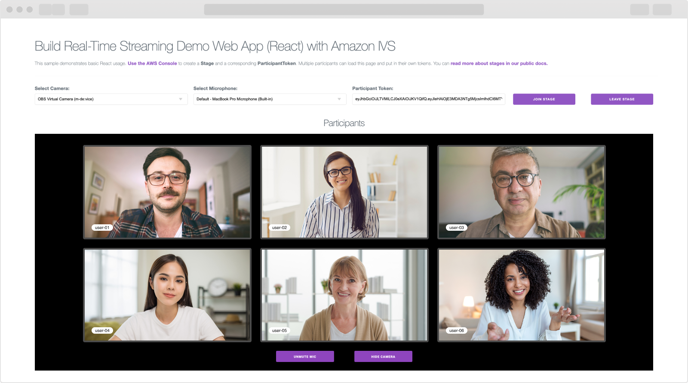

## Next steps

- Stream real-time interactions on a stage to an IVS low-latency channel to engage millions of concurrent viewers. Refer to the section "[Enabling Multiple Hosts on an Amazon IVS Stream](https://docs.aws.amazon.com/ivs/latest/LowLatencyUserGuide/multiple-hosts.html)" in the IVS Low-Latency Streaming User Guide for guidance.

- Learn more about Amazon IVS real-time streaming by visiting [Amazon IVS Real-Time Streaming User Guide](https://docs.aws.amazon.com/ivs/latest/RealTimeUserGuide/what-is.html).

- If you are interested in building for mobile platforms, explore the sample demos for [iOS](https://github.com/aws-samples/amazon-ivs-real-time-for-ios-demo/) or [Android](https://github.com/aws-samples/amazon-ivs-real-time-for-android-demo/), and the supporting [serverless applications for real-time demo](https://github.com/aws-samples/amazon-ivs-real-time-serverless-demo/).

- If you are planning on scaling your application look into using [AWS Amplify](https://aws.amazon.com/amplify/) / [AWS Lambda](https://aws.amazon.com/lambda/) for your backend.
